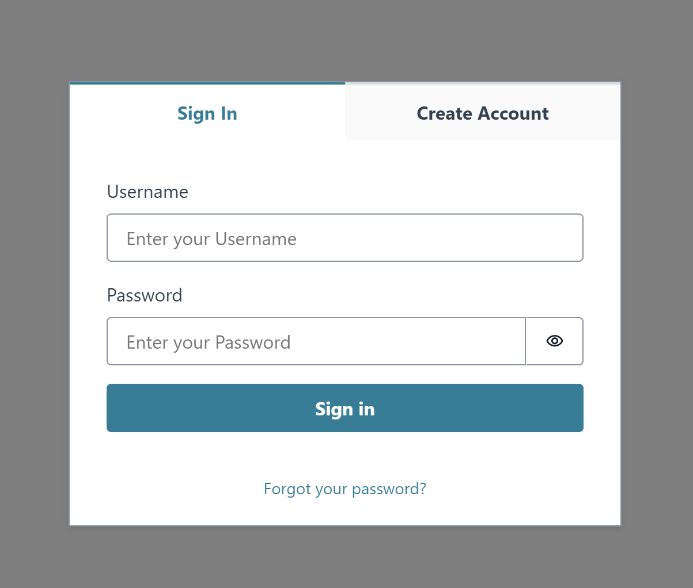
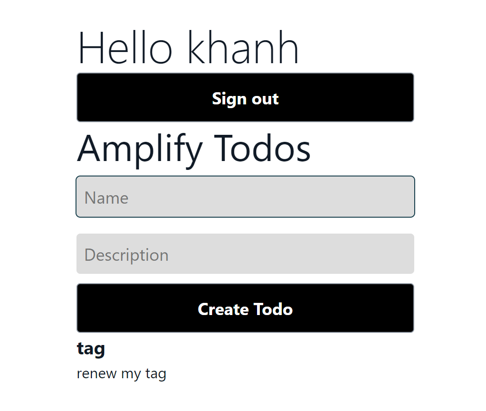

# react-amplified

I created this repository with the intention of learning AWS Amplify. Following the instructions provided in the AWS documentation, I successfully set up a simple Todo project.

## Link

Click [HERE](https://dev.d2karo2zb5dn0f.amplifyapp.com) to view the deployed application on AWS.

   

## Questions
If there are any questions or concerns, please contact me at: 
[GitHub](https://github.com/khanhpbui) 
[Email](mailto:pkkhanhbui@gmail.com)